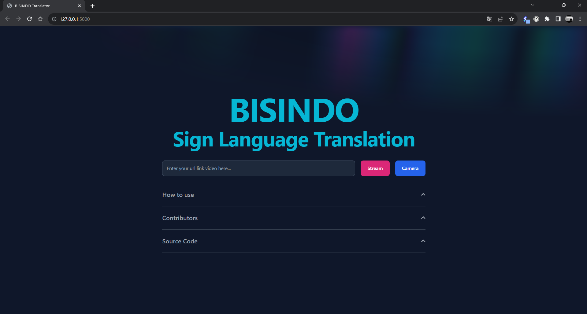
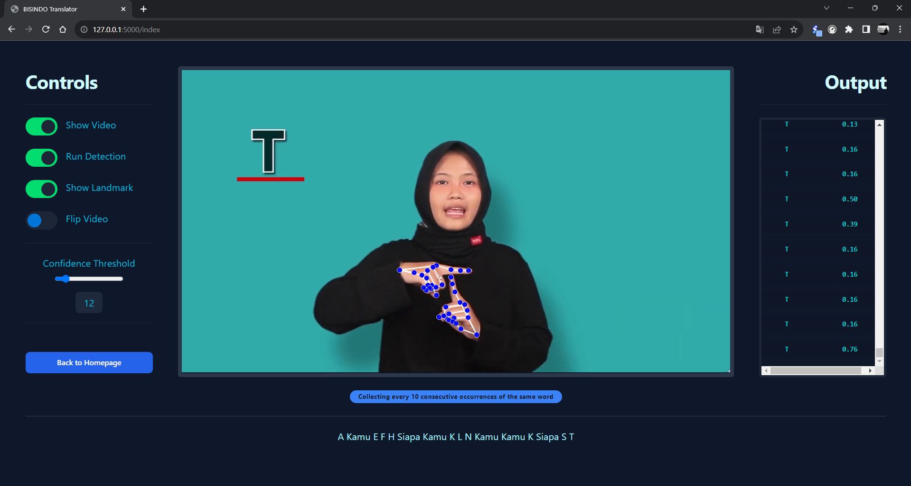
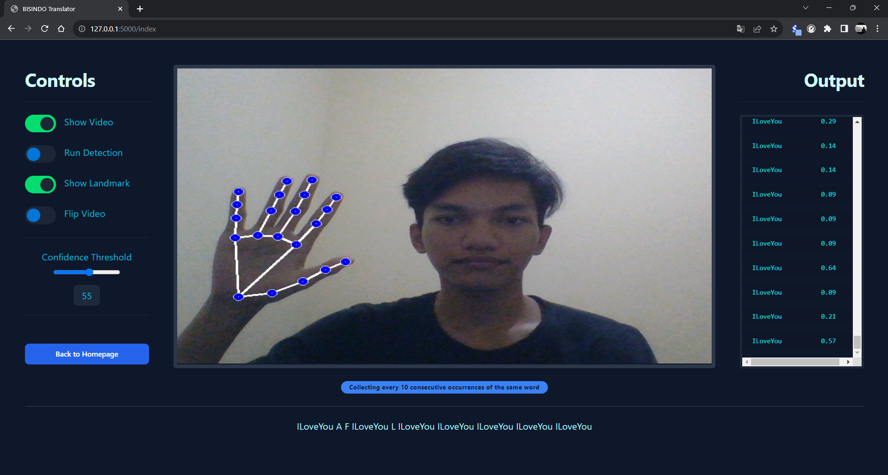
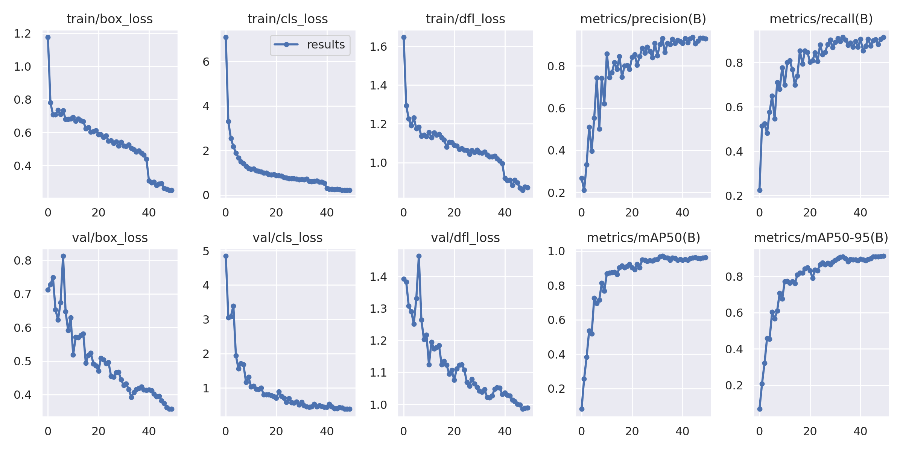

# FP-RSBP BISINDO Sign Language Translator

## Table of Contents
- [Group Member](#group-member)
- [General](#description)
  - [Description](#description)
  - [Appoarch Method](#appoarch-method)
  - [Visual Demo](#visual-demo)
  - [Step by Step Method](#step-by-step-method)
  - [Features](#features)
  - [How to Run](#how-to-run)
- [Training Model](#training-model)
  - [Check GPU](#check-gpu)
  - [Import OS](#import-os)
  - [Yolo Instalation](#yolo-instalation)
  - [Import Dataset Form Roboflow](#import-dataset-form-roboflow)
  - [Training](#training)
  - [Validate Model](#validate-model)
  - [Inference Model](#inference-model)
  - [Run Model on CAMERA](#run-model-on-camera)
- [Training Result](#training-result)
  - [Confussion Matrix](#confussion-matrix)
  - [Result Curve](#result-curve)
- [Create Flask Web Application](#create-flask-web-application)
  - [Install Requirements Dependencies](#install-requirements-dependencies)
  - [Create new app.py file for main program](#create-new-apppy-file-for-main-program)
  - [Initialize Model](#initialize-model)
  - [Create Function for Detection](#create-function-for-detection)
  - [Explanation for each object](#explanation-for-each-object)
  - [Explanation for flow of the program](#explanation-for-flow-of-the-program)
- [Integration in HTML, CSS, and Javascript](#integration-in-html-css-and-javascript)
  - [CSS](#in-css-file-create-a-style-for-the-stream-and-output)
  - [JavaScript](#in-javascript-create-a-function-needed-for-the-web-interface)
    - [For Camera or Video Button](#for-camera-or-video-button)
    - [For Terminal Output, Socket, and Final Output](#for-terminal-output-socket-and-final-output)
    - [For Toggle Button](#for-toggle-button)
  - [HTML](#for-html-integrate-the-javascript-function)
    - [For Camera and Terminal Output](#for-camera-and-terminal-output)
    - [For Toggle Switch](#for-toggle-switch)
    - [For Final Output](#for-final-output)


## Group Member

| NRP | Name | Github Account |
| --- | --- | --- |
| 5025211015 | Muhammad Daffa Ashdaqfillah | [daf2a](https://github.com/daf2a) |  
| 5025211232 | Ulima Kultsum |  [ulimakrh](https://github.com/ulimakrh) |
| 5025211252 | Nur Azizah |[dancingaroundthelies](https://github.com/dancingaroundthelies) |

## Description

This project is a final project for "Rekayasa Sistem Berbasis Pengetahuan (RSBP)". This project is a web-based application that can translate BISINDO sign language to Indonesian language. This application is made to help people who are not familiar with BISINDO sign language to communicate with people who are deaf. </br>

## Appoarch Method

This project employs the Object Detection method to identify hand gestures, utilizing a customized YOLO v8 dataset model. This model is designed to detect various hand gestures and provide the bounding box coordinates delineating these gestures. Once the bounding box is identified, the corresponding region of interest (ROI) containing the hand gesture is cropped. Subsequently, this cropped image undergoes further processing through a Convolutional Neural Network (CNN) model for precise classification of the detected hand gesture. The CNN model's output yields the specific label corresponding to the gesture identified. To enhance user experience, these labels are translated into Indonesian using a Rule-Based method before being displayed on the screen interface. </br>

In terms of visualization, the project harnesses MediaPipe, a tool enabling the drawing of hand gesture bounding boxes and their associated labels directly on the screen. This integration ensures users can visually comprehend the detected gestures in real-time with graphical representations. </br>

Moreover, the project is built as a web-based application using Flask, allowing seamless accessibility and interaction through a web interface. This framework facilitates the deployment of the hand gesture detection system within a browser, ensuring ease of use across various devices without necessitating complex setups or installations. </br>

## Visual Demo

### Dashboard
</br>

### Stream Youtube Detection
</br>

### Camera Detection
</br>

## Step by Step Method
- Train the model using YOLOv8 with custom dataset
- Create a CNN model to classify the cropped image
- Create a Flask app to run the model
- Create a web interface using HTML and CSS
- Create feature interaction using Javascript 

## Features
- Detect hand gesture from Camera
- Detect hand gesture from Youtube video
- Switch on/off the detection
- Switch on/off the landmark
- Flip the video
- Modify Confidence Threshold
- The result accumulates the detected words over 10 sequential frames

## How to Run
- Clone this repository
- Install all the requirements
- Run the app.py file
- Open the localhost link in your browser
 
# Training Model

### Check GPU

``` python
!nvidia-smi
```

### Import OS

``` python
import os
HOME = os.getcwd()
print(HOME)
```

### Yolo Instalation
``` python
%pip install ultralytics==8.0.20

from IPython import display
display.clear_output()

import ultralytics
ultralytics.checks()
```

``` python
from ultralytics import YOLO

from IPython.display import display, Image
```

### Import Dataset Form Roboflow

``` python
%mkdir {HOME}/datasets
%cd {HOME}/datasets

%pip install roboflow --quiet

from roboflow import Roboflow

from roboflow import Roboflow
rf = Roboflow(api_key="moOAxzoPZOtIzhyyco0r")
project = rf.workspace("bisindo-qndjb").project("bisindov2")
dataset = project.version(1).download("yolov8")
```
### Training

``` python
%cd {HOME}

yolo task=detect mode=train model=yolov8s.pt data={dataset.location}/data.yaml epochs=25 imgsz=800 plots=True
```

``` python
%ls {HOME}/runs/detect/train/
```

``` python
%cd {HOME}
Image(filename=f'{HOME}/runs/detect/train/confusion_matrix.png', width=600)
```
``` python
%cd {HOME}
Image(filename=f'{HOME}/runs/detect/train/results.png', width=600)
```

### Validate Model

``` python
%cd {HOME}

!yolo task=detect mode=val model={HOME}/runs/detect/train/weights/best.pt data={dataset.location}/data.yaml
```

### Inference Model

``` python
%cd {HOME}
!yolo task=detect mode=predict model={HOME}/runs/detect/train/weights/best.pt conf=0.25 source={dataset.location}/test/images save=True
```

### Run Model on CAMERA

``` python
%cd {HOME}
!yolo task=detect mode=predict model=D:/Kuliah/\(2023\)S5-RSBP/FP/runs/detect/train/weights/best.pt source=0 show=true
```

## Training Result

### Confussion Matrix

</br>

### Result Curve

</br>


## Create Flask Web Application


### Install Requirements Dependencies

To install the Python requirements from the `requirements.txt` file, run
the following command in your terminal or command prompt:

``` python
pip install -r requirements.txt
```


### Create new app.py file for main program 

Import libray that needed for this project

``` python
from ultralytics import YOLO
import time
import numpy as np
import mediapipe as mp


import cv2
from flask import Flask, render_template, request, Response, session, redirect, url_for

from flask_socketio import SocketIO
import yt_dlp as youtube_dl
```


Explanation for each library:

-   ultralytics.YOLO: Used for real-time object detection.
-   time: Handles time-related functions.
-   numpy as np: Supports numerical computations and arrays.
-   mediapipe as mp: Facilitates various media processing tasks like
    object detection and hand tracking.
-   cv2: Offers tools for computer vision, image, and video processing.
-   Flask: A lightweight web framework for building web applications.
-   Flask_socketio and SocketIO: Enables WebSocket support for real-time
    communication in Flask.
-   yt_dlp as youtube_dl: Used to stream media content from various
    streaming sites, like YouTube.


### Initialize Model

``` python
model_object_detection = YOLO("bisindo.pt")
```

### Create Function for Detection

``` python
def show(self, url):
        print(url)
        self._preview = False
        self._flipH = False
        self._detect = False
        self._mediaPipe = False

        self._confidence = 75.0
        ydl_opts = {
            "quiet": True,
            "no_warnings": True,
            "format": "best",
            "forceurl": True,
        }

        if url == '0':
            cap = cv2.VideoCapture(0)
        else:
            
            ydl = youtube_dl.YoutubeDL(ydl_opts)

            info = ydl.extract_info(url, download=False)
            url = info["url"]

            cap = cv2.VideoCapture(url)

        while True:
            if self._preview:
                if stop_flag:
                    print("Process Stopped")
                    return

                grabbed, frame = cap.read()
                if not grabbed:
                    break
                if self.flipH:
                    frame = cv2.flip(frame, 1)

                if self.detect:
                    frame_yolo = frame.copy()
                    results_yolo = model_object_detection.predict(frame_yolo, conf=self._confidence / 100)

                    frame_yolo, labels = results_yolo[0].plot()
                    list_labels = []
                    # labels_confidences
                    for label in labels:
                        confidence = label.split(" ")[-1]
                        label = (label.split(" "))[:-1]
                        label = " ".join(label)
                        list_labels.append(label)
                        list_labels.append(confidence)
                        socketio.emit('label', list_labels)

                if self.mediaPipe:
                    # Convert the image to RGB for processing with MediaPipe
                    image = cv2.cvtColor(frame, cv2.COLOR_BGR2RGB)
                    results = self.hands.process(image)
                    
                    if results.multi_hand_landmarks:
                        for hand_landmarks in results.multi_hand_landmarks:
                            mp.solutions.drawing_utils.draw_landmarks(
                                frame,
                                hand_landmarks,
                                self.mp_hands.HAND_CONNECTIONS,
                                landmark_drawing_spec=mp.solutions.drawing_utils.DrawingSpec(color=(255, 0, 0), thickness=4, circle_radius=3),
                                connection_drawing_spec=mp.solutions.drawing_utils.DrawingSpec(color=(255, 255, 255), thickness=2, circle_radius=2), 
                            )

                frame = cv2.imencode(".jpg", frame)[1].tobytes()
                yield ( 
                    b'--frame\r\n'
                    b'Content-Type: image/jpeg\r\n\r\n' + frame + b'\r\n'
                )
            else:
                snap = np.zeros((
                    1000,
                    1000
                ), np.uint8)
                label = "Streaming Off"
                H, W = snap.shape
                font = cv2.FONT_HERSHEY_PLAIN
                color = (255, 255, 255)
                cv2.putText(snap, label, (W//2 - 100, H//2),
                            font, 2, color, 2)
                frame = cv2.imencode(".jpg", snap)[1].tobytes()
                yield (b'--frame\r\n'
                       b'Content-Type: image/jpeg\r\n\r\n' + frame + b'\r\n')
```

### Explanation for each object:

-   preview(): Displays the video stream on the web interface.
-   flipH(): Flips the video horizontally.
-   detect(): Detects using Yolo model the hand gesture from the video
    stream.
-   mediaPipe(): Draws the hand gesture landmark on the video stream.

### Explanation for flow of the program:

-   If user input is \"camera\", the program will run the camera
    detection.
-   If user input is \"url youtube video\", the program will run the
    youtube detection.
-   If user activate the preview, the program will run the video
    stream/camera.
-   If user activate the detection, the program will run the detection.
-   If user activate the landmark, the program will run the landmark.
-   If user activate the flip, video will be flipped.
-   Threshold is used to set the minimum confidence threshold of the
    detection.
-   If the preview is not activated, the program will show
    `streaming off` label.


## Integration in HTML, CSS, and Javascript

### In CSS file, create a style for the stream and output

``` python
/* * Local selectors */
#container {
    width: 100%;
    height: 586px;
    border: 8px #2c374a solid;
    background-color: #0F172A;
    border-radius: 5px;
}

#videoElement {
    height: 570px;
    width: 100%;
    background-color: #0F172A;

    display: block;
    margin-left: auto;
    margin-right: auto;
}

#terminal {
    border-radius: 5px;
    border: 5px #1C2637 solid;
    font-family: monospace;
    font-size: 12px;
    background-color: #0F172A;
    height: 490px;
    overflow-y: scroll;
}
```

### In Javascript, create a function needed for the web interface

#### For Camera or Video Button

``` python
function startCamera() {
    var url = '0';
    $('#urlForm').attr('action', '/index'); 
    $('#urlForm').attr('method', 'POST'); 
    $('#urlForm').find('#url').val(url);
    $('#urlForm').submit();
}

function startVideo() {
    var url = $('#url').val();
    $('#urlForm').attr('action', '/index'); 
    $('#urlForm').attr('method', 'POST'); 
    $('#urlForm').find('#url').val(url);
    $('#urlForm').submit();
}
```

#### For terminal output, socket, and final output

``` python
var socket = io.connect('http://127.0.0.1:5000/');

let consecutiveWords = [];
let finalSentence = "";
let wordCounter = 0;

function appendToTerminal(message) {
    var terminal = document.getElementById("terminal");
    var p = document.createElement("p");
    p.innerHTML = `<table class="table table-striped text-center" style="border: none;">
                    <tr class="row">
                        <td class="col-md-6" style="color: #01ECEC; border: none;">${message[0]}</td>
                        <td class="col-md-6" style="color: #01ECEC; border: none;">${message[1]}</td>
                    </tr>
                </table>`;
    terminal.appendChild(p);
    terminal.scrollTop = terminal.scrollHeight;

    if (consecutiveWords.length === 0 || consecutiveWords[consecutiveWords.length - 1] === message[0]) {
        consecutiveWords.push(message[0]);
        wordCounter++; 
    } else {
        consecutiveWords = [message[0]];
        wordCounter = 1;
    }

    if (wordCounter >= 10) {
        finalSentence += (finalSentence.length > 0 ? " " : "") + consecutiveWords[0];
        document.getElementById("finalSentencePara").innerText = finalSentence;
        consecutiveWords = [];
        wordCounter = 0;
    }
}

socket.on("label", (data) => {
    appendToTerminal(data);
});
```

Integration with SocketIO:

-   Listens for data labeled as \"label\" from a SocketIO connection.
-   Calls appendToTerminal() to display the received data in the
    terminal and potentially update an advertisement based on the data.

Function appendToTerminal(message):

-   Takes a message as input.
-   Adds a table with two columns to the terminal for displaying the
    message.
-   Keeps track of consecutive words and their counts.
-   Constructs a final sentence if a word appears more than ten times
    consecutively.


#### For Toggle Button
``` python
function toggleHSwitch() {
    var switchElement = $("#flip-horizontal");
    var switchIsOn = switchElement.is(":checked");

    if (switchIsOn) {
        console.log("SWITCH ON")
        $.getJSON("/request_flipH_switch", function (data) {
            console.log("Switch on request sent.");
        });
    } else {
        console.log("SWITCH OFF")
        $.getJSON("/request_flipH_switch", function (data) {
            console.log("Switch off request sent.");
        });
    }
}

function toggleMediaPipeSwitch() {
    var switchElement = $("#mediapipe");
    var switchIsOn = switchElement.is(":checked");

    if (switchIsOn) {
        console.log("SWITCH ON")
        $.getJSON("/request_mediapipe_switch", function (data) {
            console.log("Switch on request sent.");
        });
    } else {
        console.log("SWITCH OFF")
        $.getJSON("/request_mediapipe_switch", function (data) {
            console.log("Switch off request sent.");
        });
    }
}

function toggleDetSwitch() {

    var switchElement = $("#run_detection");
    var switchIsOn = switchElement.is(":checked");

    if (switchIsOn) {
        console.log("SWITCH ON")
        $.getJSON("/request_run_model_switch", function (data) {
            console.log("Switch on request sent.");
        });
    } else {
        console.log("SWITCH OFF")
        $.getJSON("/request_run_model_switch", function (data) {
            console.log("Switch off request sent.");
        });
    }
}

function toggleOffSwitch() {
    var switchElement = $("#turn_off");
    var switchIsOn = switchElement.is(":checked");

    if (switchIsOn) {
        console.log("Camera ON")
        $.getJSON("/request_preview_switch", function (data) {
            console.log("Switch on request sent.");
        });
    } else {
        console.log("Camera OFF")
        $.getJSON("/request_preview_switch", function (data) {
            console.log("Switch off request sent.");
        });
    }
}
```

### For HTML, integrate the Javascript function

#### For Camera and Terminal Output

``` python
<!-- Video -->
<div class="col-span-8 mx-4 mt-3">
    <div id="container">
        
    </div>
</div>

<!-- Terminal -->
<div class="col-span-2 mr-4">
    <h2 class="border-b border-slate-800 py-4 mb-4 text-3xl flex justify-end font-bold leading-none tracking-tight md:text-4xl lg:text-4xl text-cyan-100 ">Output</h1>
    <div id="terminal" class="w-full"></div>
</div>
```


#### For toggle switch

``` python
<div class="flex gap-3 mb-4">
    <label class="switch">
        <input id="turn_off" value="1" name="turn_off" type="checkbox" onclick="toggleOffSwitch()"/>
        <span class="slider round"></span>
    </label>
    <label for="turn_off" class="form-label text-cyan-500">Show Video</label><br>
</div>
<div class="flex gap-3 mb-4">
    <label class="switch">
        <input id="run_detection" value="0" name="run_detection" type="checkbox"
               onclick="toggleDetSwitch()"/>
        <span class="slider round"></span>
    </label>
    <label for="run_detection" class="form-label text-cyan-500">Run Detection</label><br>
</div>
<div class="flex gap-3 mb-4">
    <label class="switch">
        <input id="mediapipe" value="0" name="mediapipe" type="checkbox"
               onclick="toggleMediaPipeSwitch()"/>
        <span class="slider round"></span>
    </label>
    <label for="mediapipe" class="form-label text-cyan-500">Show Landmark</label><br>
</div>
<div class="flex gap-3 mb-4">
    <label class="switch">
        <input id="flip-horizontal" value="0" name="flip-horizontal" type="checkbox"
               onclick="toggleHSwitch()"/>
        <span class="slider round"></span>
    </label>
    <label for="flip-horizontal" class="form-label text-cyan-500">Flip Video</label><br>
</div>

<div class="gap-3 py-4 text-center border-b border-slate-800 mb-5">
    <form action="/" method="POST" style="text-align: center;" class="mb-4" >
        <label for="slider" class="form-label text-cyan-500">Confidence Threshold</label>
        <input type="range" id="slider" name="slider" min="1" max="100">
    </form>
    <input type="hidden" id="sliderValue" name="sliderValue" value="75">
    <span class="rounded-lg py-2 px-3 bg-slate-800 text-cyan-500" id="conf_display">75</span>
</div>
```

#### For Final Output

``` python
<div>
    <p id="finalSentencePara" class="text-cyan-200 mt-4 text-center">
    </p>
</div>
```